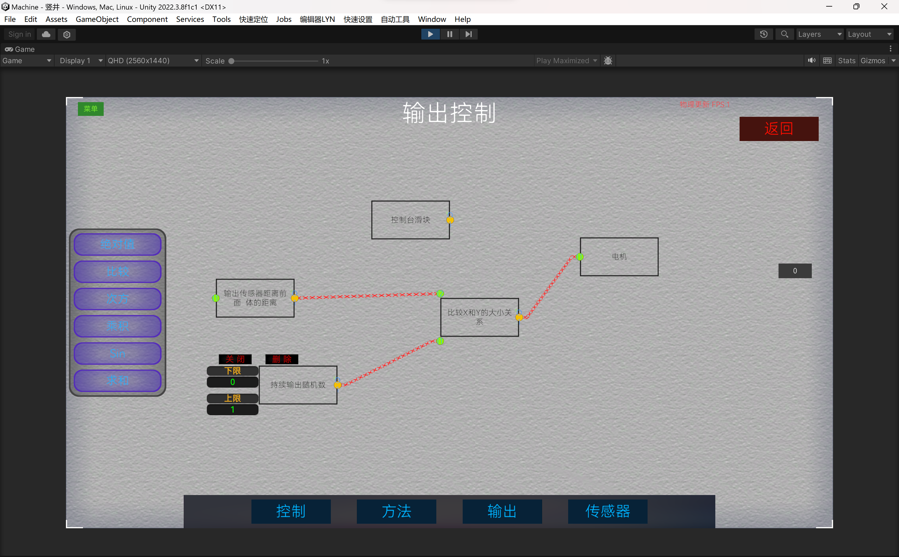
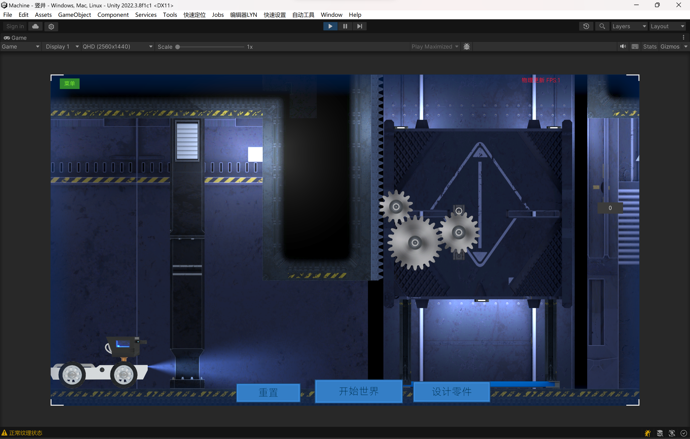

# 机械大师（MachineMaster）
## 仓库介绍
* 查看BiliBili演示视频（马上就来😄）。
* 该仓库包仅包含了工程中的部分代码（不是所有）。  
* 仓库未上传编辑器脚本，美术资源，meta文件以及工程内置文件。
* 游戏目前尚未发布，核心玩法已经确定并设计完毕。
* 

## 游戏介绍
游戏类型为2D横板关卡游戏。  
玩法：玩家在每一个关卡都需要解决一些机物理械配合问题，比如如何通过一个坑，如何让两个齿轮能够实现传动，如何让一个平台能够升降。  
* 玩家可以操控自己扮演的机器人角色进行移动和观察，物理模拟阶段，Cinemachine控制相机跟随角色。
* 玩家可以利用节点的方式，进行钢材框架设计。
* 可以进行场景其他零件创建和放置，让零件相互配合形成机械结构，如啮合的齿轮，减震弹簧，转动的电机，推动的液压器，飞行的喷气发动机。
* 玩家可以对已创建的零件进行焊接（FixedJoint）或者铰接（HingeJoint）。从而使得零件可以传动或配合。
* 还可以对一些零件进行可视化编程，如控制液压器的伸缩，电机转子的转速，喷气发动机的动力和转角。可视化编程包含多种类型节点（输入，玩家控制输入，数学运算，逻辑，传感器）。
* 还可以放置各种传感器，获取距离，角度，速度的数值用以可视化编程。在可视化编程时可以选择使用的传感器。
* 玩家可以保存每一个关卡的设计结果和可视化编程的内容，Steam客户端可自动上传到云存档，可以在不同的设备使用这些存档。
* 设计了部分Steam成就和统计功能。

## 做了什么内容
* UI：使用Unity的uGUI，关卡选择，设计零件，控制台，可视化编程界面，Steam商店（正在审核）。
* 素材：游戏内场景素材采用CC0网站纹理或购买，使用Blender设计模型和灯光并渲染出PNG图片。场景使用Tilemap，Shaperender，Sprite，2DLight等组成。
* 2D物理：物理模拟使用Unity内置的2D物理系统（Box2D）。在性能优化上主要是采用基础碰撞器，分步创建物理对象，合并碰撞器，检测代码使用无GC方法，间隔式检测等。
* 设计零件功能：设计了自动吸附功能，如多个齿轮的啮合，位置上的水平垂直吸附，关键点的吸附。  
* 可视化编程：采用根节点为起点递归方式计算结果，并控制可编程零件的行为。  
* 对于零件的铰接：采用鼠标位置检测，层级选择，纯色效果的区分。
* 对象选择优化：重叠的物体采用了类似Unity编辑的选择方案，使用栈的结构来逐步选择被覆盖的对象。
* 设计零件阶段：游设计模式下，只允许玩家开始设计零件并焊接零件，物理模拟时间速度为0。
* 物理模拟阶段：开始物理模式后，关闭编辑功能，启用物理时间，创建设计零件并激活其物理组件，编程控制台输入节点，玩家控制。
* Steam云存档：游戏使用ES3存档插件，玩家的零件设计和可视化编程设计都采用了可序列化数据结构，保存了玩家设置，零件及连接信息，可视化编程节点及其连接信息。每一个关卡的设计都可以保存，Steam会在游戏推出后自动同步。
* Steam成就与统计：设计了部分成就与统计数据。

## 正在开发什么
* 可设计网格的结构钢材，让玩家可以自定义形状。
* 物理状态下可查看的可视化编程的预览数值节点。

## 

## 游戏截图
### 关卡截图

